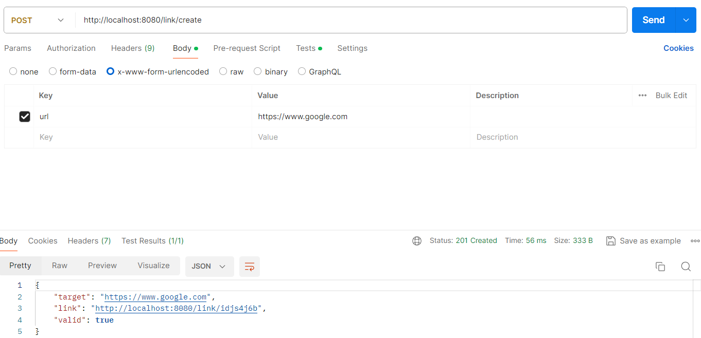
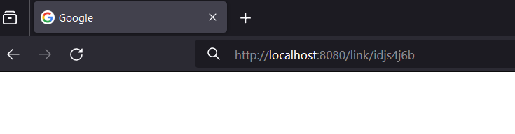
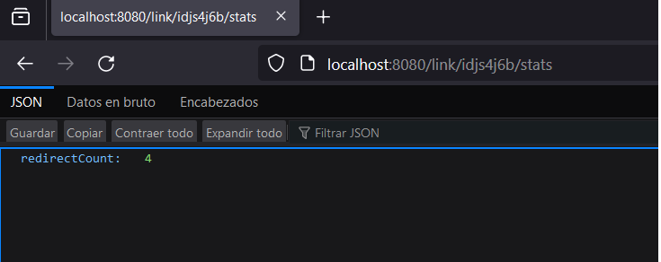

# Choice Link Tracker

Este repositorio contiene el código de Link Tracker, una aplicación desarrollada utilizando Nest.js que permite enmascarar URLs y realizar estadísticas de cantidad de veces en que un link fue redireccionado, además de proporcionar funcionalidades adicionales como agregar un password y una fecha de expiración como parámetros a los enlaces creados.

## Nestjs
> [Nestjs](http://nestjs.com/)  


## Instalación
Sigue los pasos a continuación para instalar el proyecto:

1. Posicionado en el directorio que desee clone el repositorio con: 

```bash
git clone https://github.com/lucasfrontend/link-tracker
```
2. Navegue al directorio del proyecto según su ubicación: 

```bash
cd link-tracker
```

3. Instale las dependencias: `npm install`
```bash
npm install
```

4. Corra el siguiente comando para levantar el proyecto de forma local
```bash
npm start
```

Podrá interactuar con la aplicación en [http://localhost:8080/](http://localhost:8080/)


## Crear un link

```bash
curl -X POST http://localhost:8080/link/create -d "{\"url\": \"http://example.com\"}"
```



## Redirección

- Ingrese el link en su navegador:

```bash
http://localhost:8080/link/:id
```



## Estadísticas por link

- Ingrese a /stats para ver la cantidad de veces en que ha sido redireccionado:

```bash
curl -X GET http://localhost:8080/link/:id/stats
```


## Invalidar un link

```bash
curl -X PUT http://localhost:8080/link/:id/
```

## Agregar password al enlace

```bash
curl -X GET http://localhost:8080/link/:id?password=123
```

## Agregar fecha de expiración al enlace

```bash
curl -X POST http://localhost:8080/link/:id?expirationDate=2024-12-31

```
